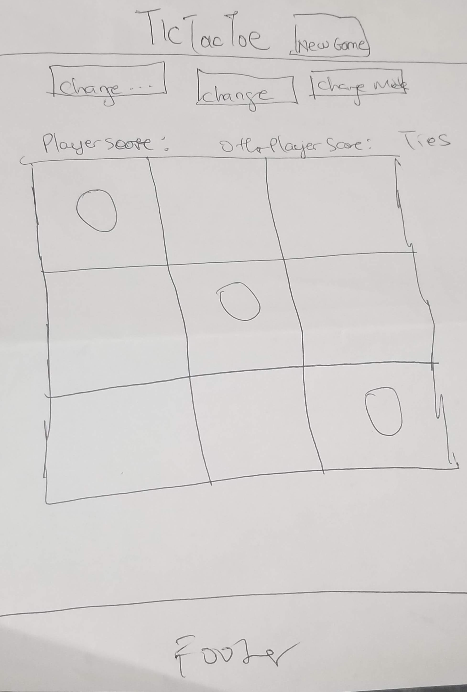
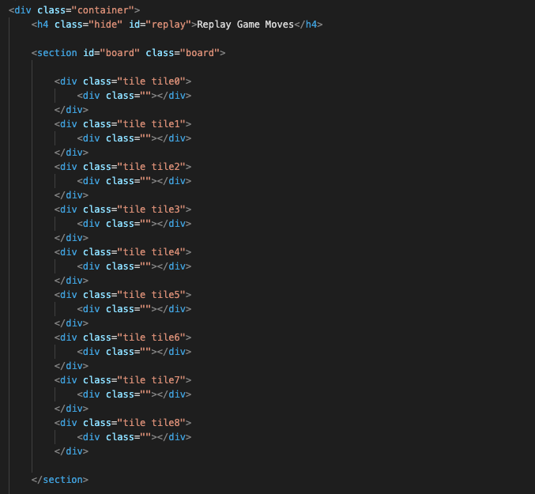

# Project: Tic Tac Toe Game (browser game)

## Links:

- Wireframe:
  

- [Game link](https://lnosaomok.github.io/tictactoe/#).

## Preview

This is a tic tac toe game that allows a user to play the traditional tic tac toe game by clicking on tiles displayed in the game. A user can either play against themselves or against the computer (AI). Scores are tracked for both the user and the computer/other player. Each round can either end in a tie or the player or computer gets a point. After a round is over, a modal opens to inform user of the round outcome and gives the user a choice of either proceeding to the next round or going back to the board where they can then either go to the next round from there, get a new game, change modes or replay the last game.

The game uses local storage so tile positions are not cleared when user refreshes. Scores are not cleared either unless the user changes the game mode or goes to a new game.

## Technology used:

- HTML, CSS and Javascript (no frameworks)-- (Local Storage, CSS Animations, Flexbox/Grid, Semantic HTML)

## Approach:

I used a combination of functions, class properties and methods, local storage and event listeners to keep track of the user's position and score the game. Each tile in the board has a child element Div and the tiles themselves have individual classes and a shared class ("tile). There is an event listener on the board tiles that reports which tile was clicked, so long as the tile has not been clicked before. Depending on the mode chosen, the tile clicked has a class (which has an animation that draws either a circle or square). The tile clicked has the class of either circle or square added to it. Then, if the mode is play with computer, the AI function determines where the computer should play. Then the scoring function checks if the tiles click so far meet the winning conditions or tie condition.

- HTML Structure:
  

### How i solved for the winner:

I used a combination of arrays and event listeners. Each time a tile is clicked, a class is attached to it(either circle or square) and the class is pushed to an array collecting all the tiles that have classes so far. I also declared two scoring functions that check the array for the various patterns that indicate a win. Another array, which contains all the permutations that indicate a win checks each winning pattern and returns the first one that matches by looping over and breaking the loop once a winning permutation is found. If none of the functions in the array returns a winning permutation and the board is fully occupied, a tie is declared.

## Main features:

- Score tracker.
- Game Replay.
- Modals to guide user (when game is won, lost or tied);
- Game can be continued after refreshing the page
- Audio for the winning and tie conditions.
- User can play against AI.

## User Stories

- As a user, I should be able to start a new tic tac toe game (when I land on the screen or click new game/change game mode.)
- As a user, I should be able to click on a square to add O first and then [], and so on.
- As a user, I should be shown a message after each turn for if I win, lose, tie or who's turn it is next
- As a user, I should not be able to click the same square twice
- As a user, I should be shown a message when I win, lose or tie
- As a user, I should not be able to continue playing once I win, lose, or tie
- As a user, I should be able to play the game again without refreshing the page.
- As a use, I should be able to replay the last game I played.
- As a user, I should be able to continue game after refreshing and the tiles I already clicked on should remain and my scores should remain.
- As a user, I want to be able to keep track of my scores even after refreshing.
- As a user I want to be able to change my name/game mode/start a new game from the board without refreshing.
- As a user I want to her audio feedback when I win, lose or tie a game.

## What left?

- Find all the bugs and destroy them.
- Create a way for user to choose their tile and customize it.
- Stop AI from playing turn when the user has won
